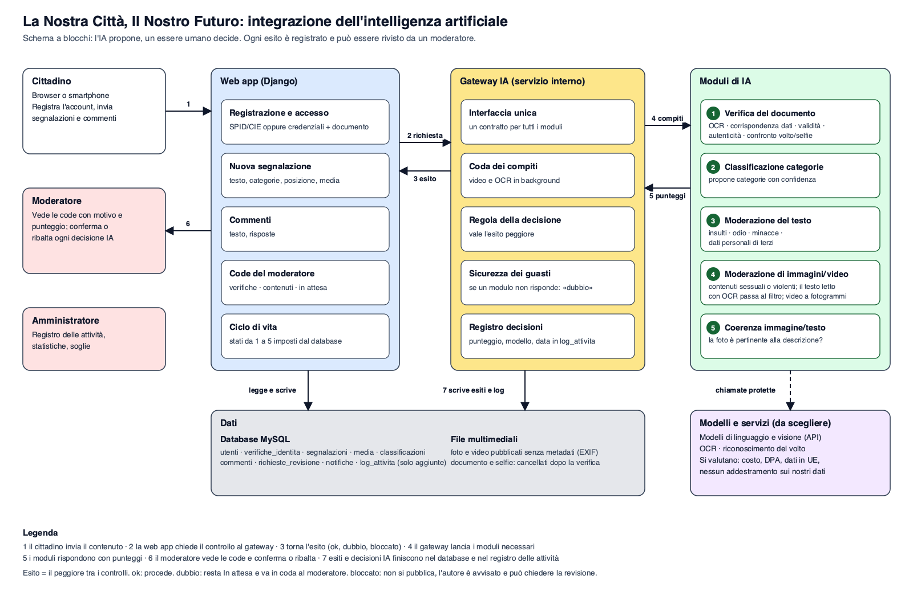
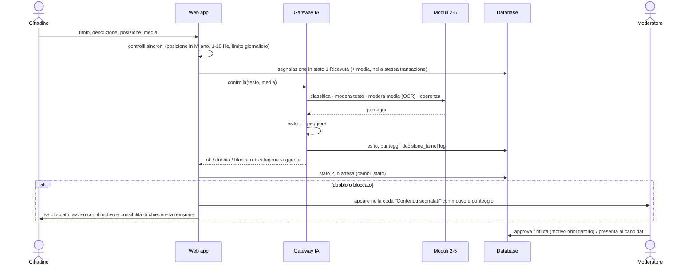

# Integrazione dell'intelligenza artificiale (materiale 3)

Schema a blocchi: [`architettura_ia.png`](architettura_ia.png) (sorgente vettoriale [`architettura_ia.svg`](architettura_ia.svg), generato da `tools/ia/schema_blocchi.py`).



## Principi

1. **L'IA propone, una persona decide.** Ogni decisione automatica si può rivedere: il moderatore conferma o ribalta, l'utente può sempre chiedere la revisione (GDPR, art. 22).
2. **Esito = il peggiore tra i controlli** (`ok` < `dubbio` < `bloccato`). Un controllo che non risponde vale `dubbio`: nel dubbio decide una persona, mai il silenzio.
3. **Tutto è tracciabile.** Punteggio, esito, modello e data finiscono nel database e in `log_attivita` (operazione `decisione_ia`, attore `sistema`). Solo aggiunte: lo garantiscono i trigger.
4. **Minimizzazione dei dati.** Documento e selfie si cancellano appena finita la verifica; dei file si tengono solo esito e punteggio. I metadati (EXIF) si tolgono prima della pubblicazione. Al fornitore si invia solo il necessario.
5. **Un'interfaccia unica.** La web app non conosce i fornitori: parla con il gateway, che offre un contratto per compito. Cambiare modello non tocca il resto.

## I blocchi

| Blocco | Ruolo |
|---|---|
| Web app (Django) | riceve contenuti, chiama il gateway, mostra l'esito, gestisce code e ciclo di vita (`transizioni_ammesse` + trigger) |
| Gateway IA | un'unica interfaccia, coda dei compiti lenti (video, OCR), regola dell'esito peggiore, gestione dei guasti, registro delle decisioni |
| 1 Verifica del documento | OCR · corrispondenza dei dati col modulo · validità e codici di controllo · autenticità · confronto volto/selfie → punteggio 0-100 |
| 2 Classificazione | propone una o più categorie con confidenza |
| 3 Moderazione del testo | insulti, linguaggio volgare, odio, minacce, dati personali di terzi (telefoni, targhe) |
| 4 Moderazione di immagini e video | contenuti sessuali o violenti; per i video, fotogrammi campione; **OCR** del testo nell'immagine che poi passa dal modulo 3 |
| 5 Coerenza immagine/testo | la foto è pertinente alla descrizione e alla categoria? |
| Modelli e servizi | fornitori di modelli di linguaggio, visione, OCR e riconoscimento del volto: da scegliere |
| Dati | MySQL, file multimediali, area temporanea per documento e selfie |

## Flussi

### A. Invio di una segnalazione



Con `bloccato` la segnalazione non viene pubblicata; con `dubbio` resta In attesa e il moderatore vede il problema rilevato. Le categorie suggerite si mostrano già selezionate: l'utente le conferma o le cambia e il sistema registra se le ha scelte l'IA, l'utente o un moderatore (`classificazioni.origine`), così si misura nel tempo la precisione del modello.

### B. Registrazione con credenziali (verifica del documento)

```mermaid
sequenceDiagram
    actor U as Cittadino
    participant W as Web app
    participant G as Gateway IA
    participant V as Modulo 1
    participant D as Database
    actor O as Moderatore
    U->>W: dati + fronte/retro del documento + selfie dal vivo
    W->>W: salva le immagini in un'area temporanea cifrata
    W->>G: verifica(documento, selfie, dati del modulo)
    G->>V: OCR, corrispondenza, validità, autenticità, volto
    V-->>G: cinque esiti + punteggio
    G->>D: verifiche_identita + decisione_ia nel log
    G-->>W: approvata (>=85) / da_rivedere (50-84) / rifiutata (<50)
    W->>W: cancella immagini e selfie
    alt da_rivedere
        W->>O: coda "Verifiche da rivedere" (stato dei controlli e punteggio)
        O->>D: conferma o ribalta, con motivo
    else rifiutata
        W->>U: motivo; fino a 3 tentativi; richiesta di revisione sempre possibile
    end
```

L'account diventa **attivo** quando la verifica è approvata *e* l'email è confermata. Con SPID/CIE non serve alcun controllo IA: l'identità è già certificata.

### C. Commento

Testo → modulo 3. `ok` si pubblica; `dubbio` si pubblica e va in coda al moderatore; `bloccato` non si pubblica e l'autore riceve il motivo.

## Regole di decisione

| Verifica documento | Esito |
|---|---|
| punteggio ≥ 85 | approvata |
| 50 - 84 | da rivedere (coda del moderatore) |
| < 50 | rifiutata (l'utente riceve il motivo e può riprovare, al massimo 3 volte) |

| Contenuto (testo, media, coerenza) | Esito | Conseguenza |
|---|---|---|
| nessun problema | `ok` | prosegue nel ciclo di vita |
| problema incerto | `dubbio` | resta In attesa, coda del moderatore con il motivo |
| contenuto grave (sessuale, violento, d'odio, minacce) | `bloccato` | non si pubblica, l'autore è avvisato e può chiedere la revisione |

Le soglie vanno **tarate sui dati reali**: per questo ogni punteggio è salvato (`punteggio_moderazione`, `punteggio_coerenza`, `punteggio_sessuale`, `punteggio_violenza`, `verifiche_identita.punteggio`) e il pannello amministratore mostra la quota di decisioni dell'IA ribaltate dai moderatori.

## Guasti e limiti

- **Timeout o errore di un modulo:** esito `dubbio`, con motivo «controllo non disponibile»; la segnalazione non si perde e non si pubblica da sola.
- **Compiti lenti** (video, OCR): in coda, la segnalazione resta Ricevuta finché non sono finiti.
- **Falsi positivi e falsi negativi:** nessun modello è perfetto. Per questo l'esito peggiore non basta: la revisione umana è sempre disponibile e le decisioni ribaltate si contano.
- **Richieste al fornitore:** con limite di frequenza e nuovo tentativo con attesa crescente. Un'interruzione del fornitore rallenta le pubblicazioni (tutto va in coda al moderatore) ma non blocca l'accesso al sito.

## Protezione dei dati

| Tema | Scelta |
|---|---|
| Dati biometrici (art. 9) | consenso esplicito solo nel percorso con credenziali; il volto serve solo al confronto con il selfie |
| Decisioni automatiche (art. 22) | informativa dedicata; revisione umana sempre richiedibile |
| Documento e selfie | area temporanea cifrata, cancellati a verifica conclusa; si conservano esito, punteggio, data e revisore |
| Fornitori | accordo di trattamento dei dati, dati in UE se possibile, nessun addestramento sui nostri dati, valutazione d'impatto (DPIA) prima dell'uso reale |
| Metadati dei media | EXIF e dati del dispositivo rimossi prima della pubblicazione |

## Dove sta nel progetto

| Elemento | Oggi |
|---|---|
| Esiti e punteggi | colonne `esito_moderazione`, `punteggio_*`, `esito_visione`, `testo_ocr` in `segnalazioni`, `media`, `commenti`; `verifiche_identita` |
| Origine delle categorie | `classificazioni.origine` (`ia`, `utente`, `moderatore`) e `confidenza` |
| Registro | `log_attivita` con operazione `decisione_ia` |
| Code del moderatore | `/moderazione/` in `apps/web` |
| Controlli IA | **simulati** in `apps/web/core/services/ia_simulata.py` (parole chiave ed espressioni regolari): stessa forma di risposta dei servizi veri |
| Verifica del documento | caricamento **vero** (fronte, retro, selfie dalla fotocamera, JPG/PNG/PDF fino a 5 MB, controlli sui byte dei file), archivio temporaneo cifrato (`core/services/temporaneo.py`) con cancellazione a fine verifica, massimo 3 tentativi; il controllo è **simulato** in `core/services/verifica_documento.py` (qualità delle immagini al posto di OCR, dati, validità, autenticità e volto) |

## Passi per l'IA vera

1. Estrarre un'interfaccia (`core/services/ia/`) con le cinque funzioni e portare lì `ia_simulata`.
2. Scegliere i fornitori (costo, DPA, UE) e implementare un adattatore per ciascun modulo.
3. Spostare i compiti lenti su una coda con un worker.
4. Aggiungere il campo «modello e versione» alle decisioni salvate.
5. Tarare le soglie su un campione di contenuti etichettati e rivedere la qualità con i moderatori.
